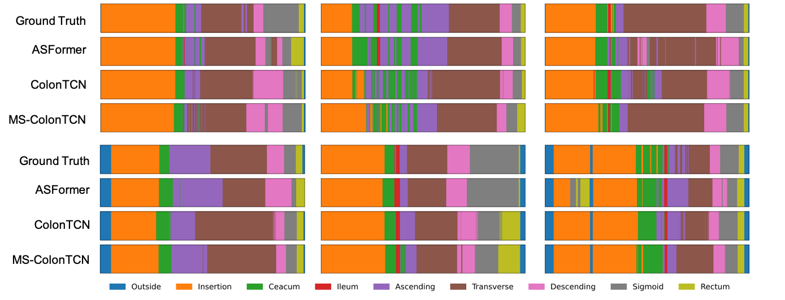

# Temporal Segmentation of Full-Procedure Colonoscopy Videos

## Overview
This repository accompanies the paper "A Temporal Convolutional Network-Based Approach and a Benchmark Dataset for Colonoscopy Video Temporal Segmentation" [1]. It provides the implementation of ColonTCN, a Temporal Convolutional Network-based approach for segmenting colonoscopy videos into anatomical sections and procedural phases. The project leverages a benchmark dataset derived from the annotated REAL-Colon (RC) dataset, which features 2.7 million frames across 60 full-procedure videos, and proposed two k-fold validation splits and metrics to evaluate model performance.



## Getting Started  

Clone the repository and set up a virtual environment  
```bash
git clone https://github.com/YOUR_USERNAME/temporal_segmentation.git  
cd temporal_segmentation  
python -m venv venv && source venv/bin/activate  # On macOS/Linux  
venv\Scripts\activate  # On Windows  
```

Install the necessary dependencies from the `requirements.txt` file:
```bash
pip install -r requirements.txt
```

## REAL-Colon Temporal Segmentation Benchmark
The benchmark dataset used in this project is the REAL-Colon (RC) dataset [2]. [Click here](./data/README.md) for instructions on automatically downloading, extracting, and preparing data splits for benchmarking temporal segmentation models.

## ColonTCN
The pretrained ColonTCN models obtained in [1] are available at the following link for both the 4-fold and 5-fold scenario:

🔗 [Google Drive – ColonTCN Checkpoints](https://drive.google.com/drive/folders/1MBTqg0OYjDXCpMTUcBNGihpaoQUpbfV9?usp=sharing)

To use them, download the entire folder and place the contents into: `experiments/model/`. Then, run:

```bash
CUDA_VISIBLE_DEVICES=0 python3 src/test_shared_model.py -parFile ymls/inference/test_shared_4fold_colontcn.yml
CUDA_VISIBLE_DEVICES=0 python3 src/test_shared_model.py -parFile ymls/inference/test_shared_5fold_colontcn.yml
```
## Model Training
Models are trained in a 4-fold or 5-fold setting on RC using the following command and specific configuration files for each fold.
```
CUDA_VISIBLE_DEVICES=0 python src/training.py -parFile ymls/training/colontcn_4fold/training_colontcn_4fold_fold1.yml
```
All configuration files for training a ColonTCN model in the 4-fold or 5-fold setting are reported at:
```
ymls/training/colontcn_4fold/
ymls/training/colontcn_5fold/
```

## Automated Model Evaluation on the RC Benchmark
To test models in the 4-fold or 5-fold setting src/training.py on RC using the following command and specific configuration files for each fold.
```
CUDA_VISIBLE_DEVICES=0 python3 src/inference_testing_on_folds.py -parFile ymls/inference/inference_testing_4fold_colontcn.yml
CUDA_VISIBLE_DEVICES=0 python3 src/inference_testing_on_folds.py -parFile ymls/inference/inference_testing_5fold_colontcn.yml
```

## Model Profiling

To profile a model for its computational efficiency such as inference time and memory usage.

```
CUDA_VISIBLE_DEVICES=0 python src/profiling.py --config ymls/profiling/colontcn_4fold.yml
CUDA_VISIBLE_DEVICES=0 python src/profiling.py --config ymls/profiling/colontcn_5fold.yml
```

## Project Structure

The following is an overview of the repository structure.  
Files and directories marked as "(ignored)" are not included in the repository due to `.gitignore`.

```
├── data/  
│   ├── create_embeddings_datasets.py  # Script to embed RC videos into video latent representations using a frame encoder
│   ├── dataset/  
│   │   ├── RC_annotation/  # RC dataset annotations (CSVs) released with this work (ignored) 
│   │   ├── RC_dataset/  # Raw RC dataset downloaded from Figshare (ignored) 
│   │   ├── RC_embedded_dataset/  # RC dataset videos embedded with a frame encoder (ignored) 
│   │   ├── RC_lists/  # Fold-based data splits (4-fold and 5-fold) for model benchmarking  
│   ├── images/  # Images used in the repository (e.g., visualizations, results)
│   ├── ymls/  # YAML config files for dataset processing
│   ├── README.md  # Documentation for the `data/` directory
├── experiments/  
│   ├── outputs/  # Output training folders and Inference/testing results (ignored) 
    ├── models/  # ColonTCN models proposed in [1]  (ignored)  
    ├── temp_datasets/  # Folder where to save temp datasets to speed up training and testing (ignored)  
│   ├── visualizations/  # Output visualizations (ignored)  
├── src/  # Main source code directory
│   ├── data_loader/
│   │   ├── embeddings_dataset.py  # Data loader for embedding-based datasets
│   ├── feature_extraction/
│   │   ├── feature_extraction.py  # Feature extraction module for processing RC videos
│   │   ├── frame_classification_model.py  # Frame-wise classification model
│   │   ├── video_loader.py  # Handles video file reading and frame extraction
│   │   └── ymls/  # YAML config files for feature extraction
│   │       ├── feature_extraction_1x_RC.yml
│   │       ├── feature_extraction_5x_aug_RC.yml
│   ├── inference.py  # Script for performing inference on the trained model
│   ├── inference_testing_on_folds.py  # Script for testing inference across multiple data folds
│   ├── models/
│   │   ├── colontcn.py  # Implementation of the Colontcn model
│   │   ├── factory.py  # Model factory for loading different architectures
│   │   ├── layers.py  # Custom model layers
│   ├── optimizers/
│   │   ├── builders.py  # Optimizer builder functions
│   │   ├── losses.py  # Loss functions for training
│   ├── profiling.py  # Profiling script to analyze performance
│   ├── testing.py  # Unit tests for model evaluation
│   ├── training.py  # Main training script
│   └── utils/
│       ├── io.py  # Utility functions for file I/O operations
├── .gitignore  # Specifies ignored files for version control  
├── README.md  # Main project documentation
├── ymls/  # Folder containing Training/Testing/Profiling config files
```

## References
If you find the work of this repository useful, please consider to cite in your work:  

[1] Biffi, C., Roffo, G., Salvagnini, P., & Cherubini, A. (2025). A Temporal Convolutional Network-Based Approach and a Benchmark Dataset for Colonoscopy Video Temporal Segmentation. arXiv preprint arXiv:2502.03430.  
[2] Biffi, C., Antonelli, G., Bernhofer, S., Hassan, C., Hirata, D., Iwatate, M., Maieron, A., Salvagnini, P., & Cherubini, A. (2024). REAL-Colon: A dataset for developing real-world AI applications in colonoscopy. Scientific Data, 11(1), 539. https://doi.org/10.1038/s41597-024-03359-0

## Contact
For any inquiries, please open an issue in this repository or write at cbiffi@cosmoimd.com
